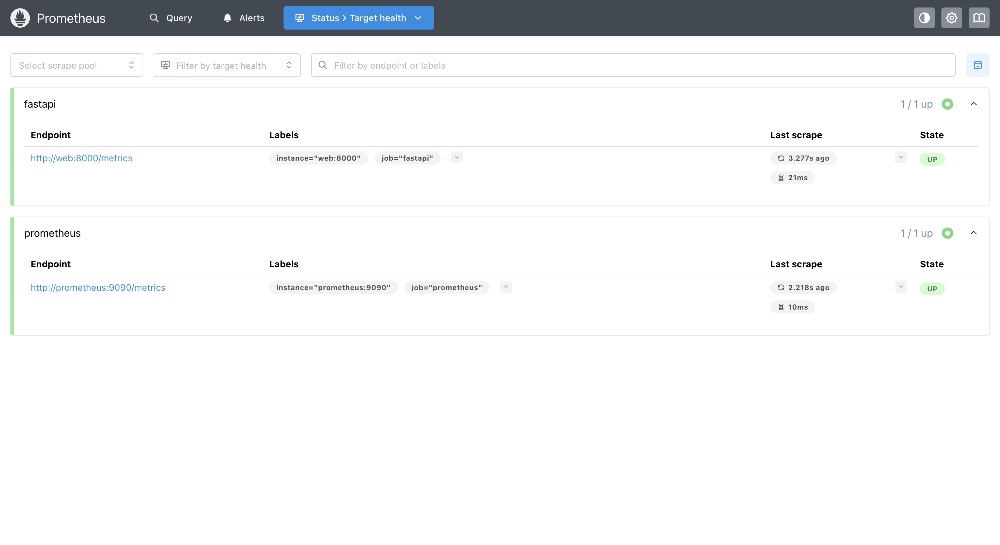
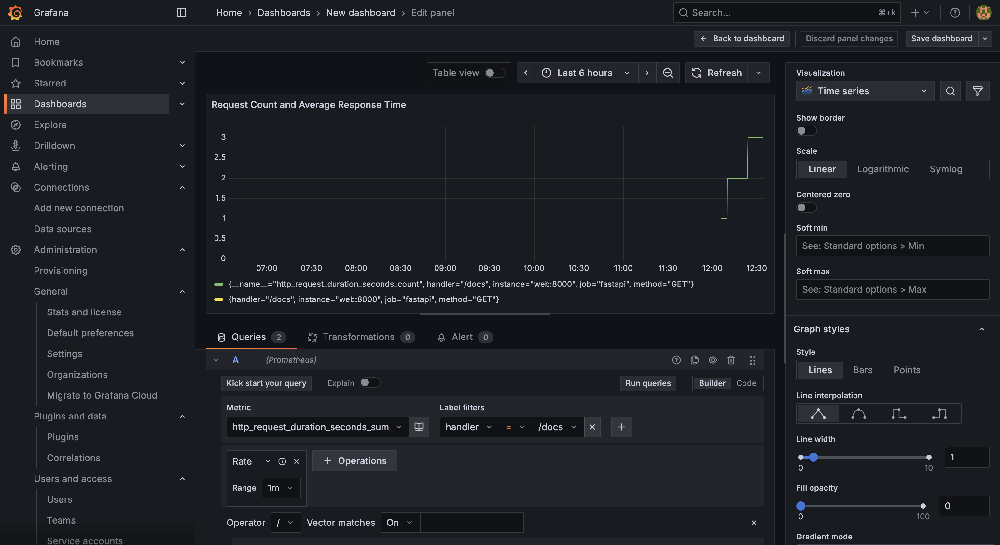
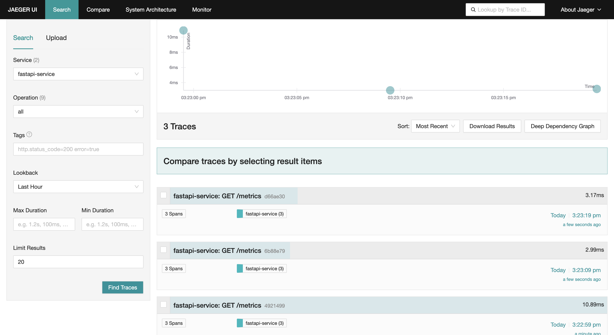
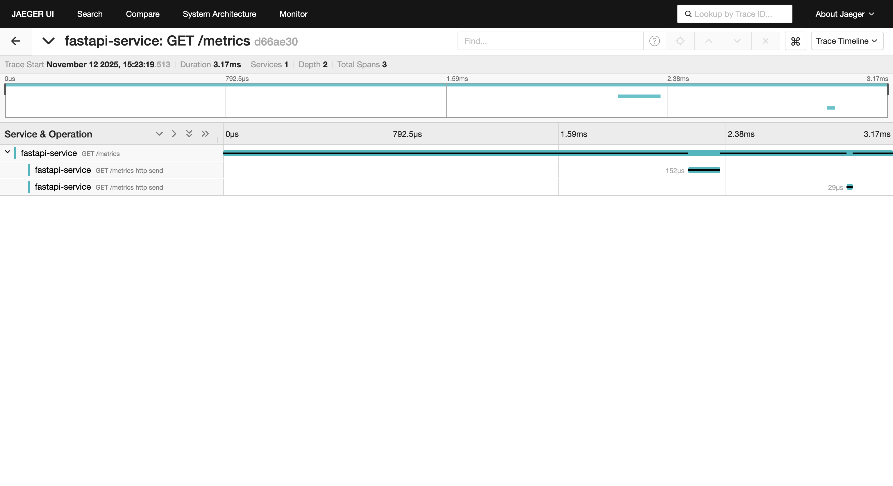
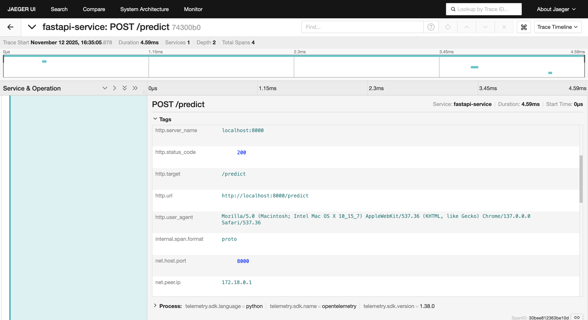
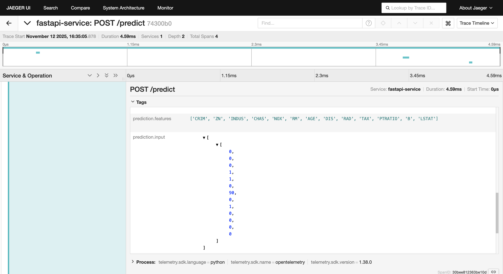
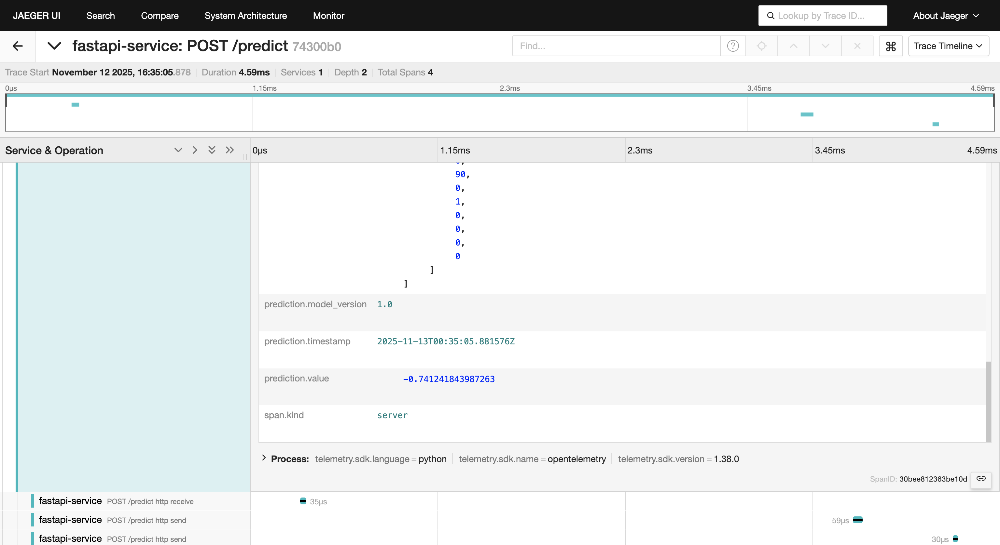

# A3 Assignment Report

## 1. Add Prometheus and Grafana Monitoring to FastAPI

In this assignment, I integrated **Prometheus** and **Grafana** into my FastAPI application to monitor API performance metrics such as request count, response time, and error rate.

* **Prometheus** collects metrics data from the `/metrics` endpoint.
* **Grafana** visualizes these metrics as real-time dashboards.

**Access URLs:**

* FastAPI app: [http://localhost:8000](http://localhost:8000)
* Prometheus: [http://localhost:9090](http://localhost:9090)
* Grafana: [http://localhost:3000](http://localhost:3000)
  (After logging in, add Prometheus as a data source in Grafana.)

 Example metrics viewable in Grafana:

* `http_request_duration_seconds_count`
* `http_request_duration_seconds_sum`

You can calculate average response time using the following PromQL expression:

```promql
rate(http_request_duration_seconds_sum[1m]) / rate(http_request_duration_seconds_count[1m])
```



---

## 2. Add OpenTelemetry Instrumentation to the Project

I used the **OpenTelemetry (OTel)** library to instrument the FastAPI application and enable **distributed tracing**.
This allows automatic recording of request execution paths and latencies, with trace data sent to **Jaeger**.

**Access URL:**

* Jaeger UI: [http://localhost:16686](http://localhost:16686)

In the Jaeger interface, traces generated by the FastAPI service can be viewed.
Each request to `/predict` or `/` produces a new trace.







---

## 3. Add Custom Data to OTel Spans

In the `/predict` endpoint, I added custom trace data — including the predicted value (`prediction.value`), model version, and client IP.
This enables viewing key request-specific data in Jaeger’s **Trace Details** view.

Example code snippet:

```python
# OpenTelemetry trace information
    current_span = trace.get_current_span()
    if current_span and current_span.is_recording():
        current_span.set_attribute("prediction.value", y_pred)
        current_span.set_attribute("prediction.model_version", version_to_use)
        current_span.set_attribute("prediction.app_version", APP_VERSION)
        current_span.set_attribute("prediction.features", str(features))
        current_span.set_attribute("prediction.input", str(X.tolist()))
        current_span.set_attribute("prediction.timestamp", metadata["prediction_time"])
```
Open Jaeger: [http://localhost:16686](http://localhost:16686)
Search for the `fastapi-service` service → click a trace → expand to view custom attributes such as `prediction.value`.

---

## Summary

Through this assignment, I accomplished the following:

* Integrated FastAPI with Prometheus and Grafana for performance monitoring and visualization;
* Added OpenTelemetry instrumentation for automatic distributed tracing;
* Included custom trace attributes such as prediction values and model version;
* Verified full observability across the stack — from FastAPI requests → Prometheus → Grafana → Jaeger.
* AI tools (ChatGPT) were used to help understand MLflow model registration requirements, debug issues, and improve 
documentation clarity.
